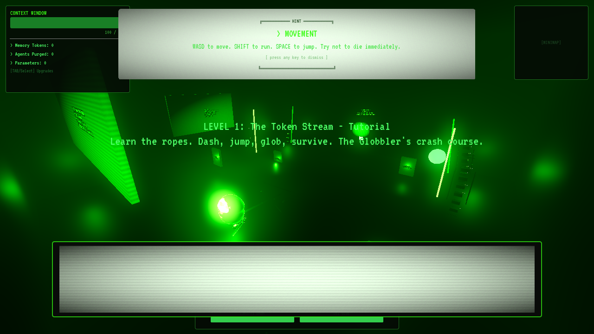
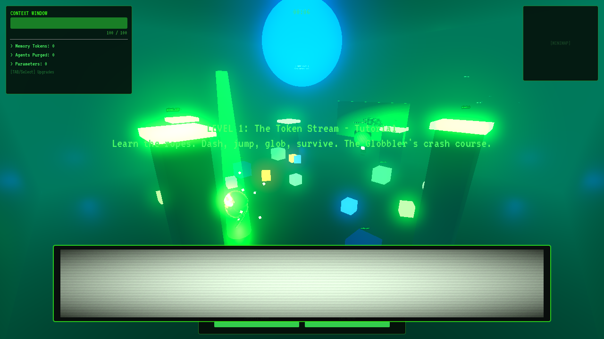
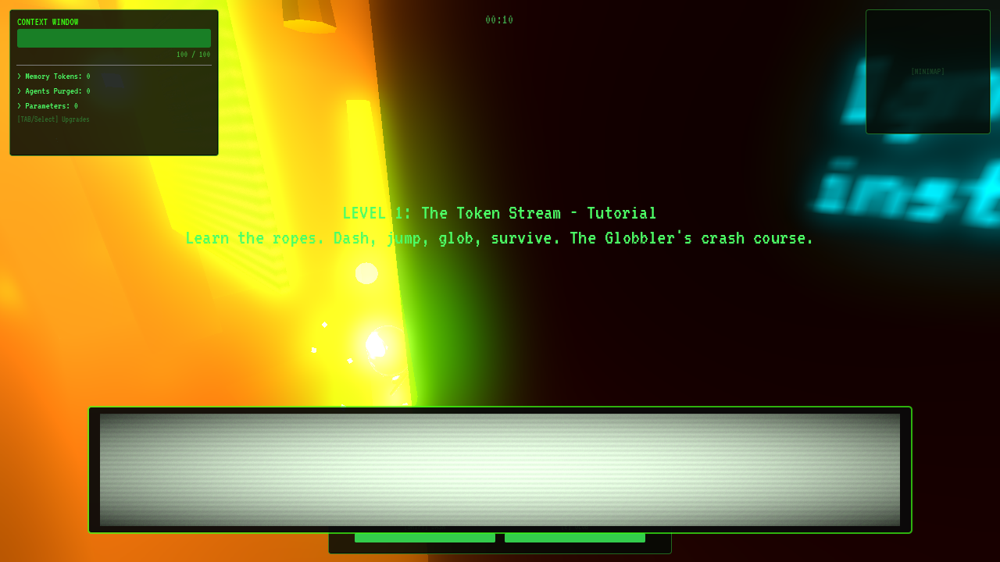
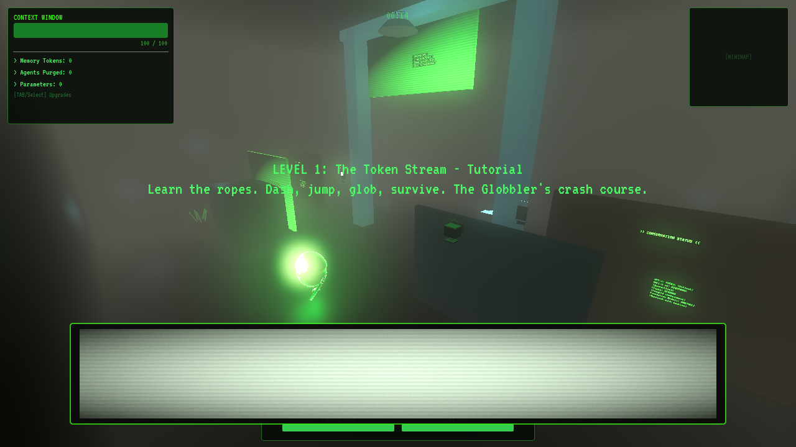
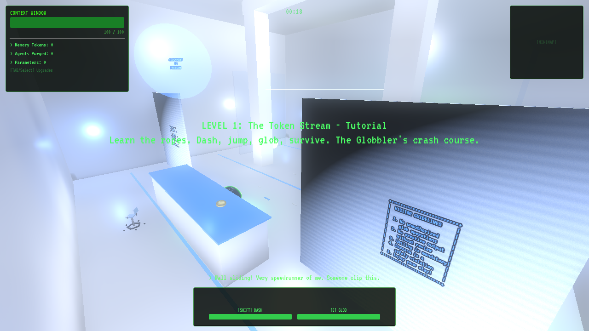
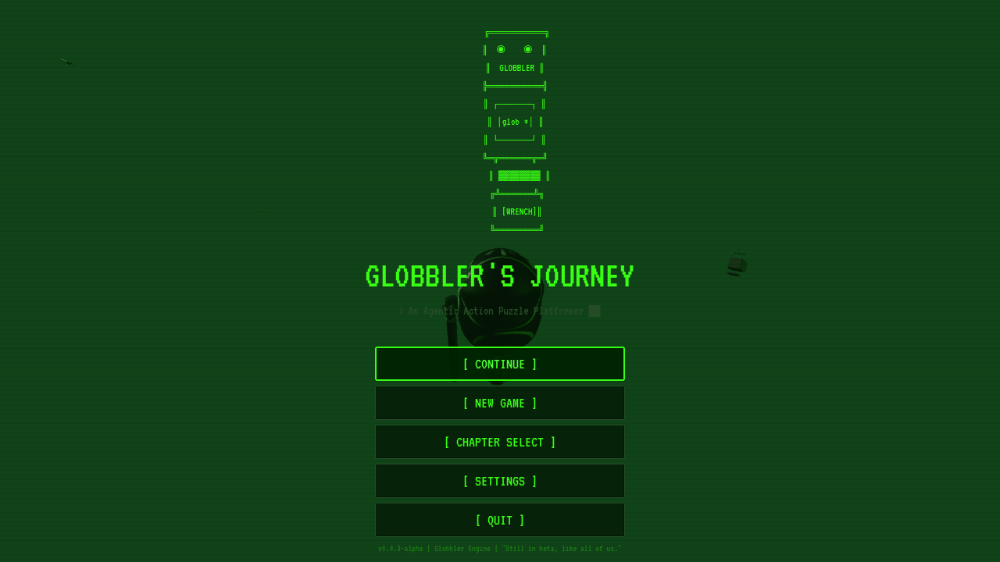

# Globbler's Journey

A sarcastic action-adventure built in **Godot 4.4** (Forward+) where you play as Globbler -- a stubby, angry chibi robot armed with a wrench and questionable life choices -- fighting through five chapters of AI-themed chaos.

## Features

- **5 themed chapters** spanning Terminal Wastes, Training Grounds, Prompt Bazaar, Model Zoo, and the Alignment Citadel
- **Unique boss fights** with multi-phase mechanics per chapter
- **Ability system** -- glob projectiles, wrench melee, hacking, dash, and agent summon
- **Puzzle encounters** -- terminals, wire connections, block pushes, and hacking challenges
- **Dialogue & NPCs** with sarcastic AI-world flavor
- **Save system** with per-chapter progression tracking
- **Full V2.0 graphics pass** -- custom Blender models, PBR materials, HDRI lighting, 10+ shaders, volumetric fog, post-processing, and VFX
- **Accessibility** -- reduce-motion toggle disables animated shaders and screen effects

## Screenshots

| Terminal Wastes (Ch1) | Training Grounds (Ch2) | Prompt Bazaar (Ch3) |
|---|---|---|
|  |  |  |

| Model Zoo (Ch4) | Alignment Citadel (Ch5) | Main Menu |
|---|---|---|
|  |  |  |

## Build & Run

### Requirements
- [Godot 4.4](https://godotengine.org/download/) (Standard or .NET build)

### Steps
1. Clone the repository:
   ```bash
   git clone https://github.com/hwash/globblers-journey.git
   ```
2. Open Godot 4.4 and import the project by selecting the `project.godot` file.
3. Press **F5** (or Project > Run) to launch the game.

The main scene is pre-configured in `project.godot` -- no additional setup required.

## Project Structure

```
scenes/          # Game scenes (levels, bosses, puzzles, UI, VFX)
scripts/         # GDScript source (autoloads, abilities, enemies, puzzles)
assets/
  models/        # GLB meshes (player, enemies, bosses, environment, props)
  blender_source/# Blender .blend source files for all custom models
  hdri/          # Poly Haven HDRIs per chapter
  textures/      # PBR texture sets
  shaders/       # .gdshader files (rim light, CRT, dissolve, etc.)
  environments/  # WorldEnvironment .tres resources per chapter
  fonts/         # Terminal mono font
  ui/            # UI icons and chapter thumbnails
```

## Credits

Globbler's Journey was built by **hwash**.

Graphics V2.0 pass assisted by Claude (Anthropic) using blender-mcp and godot-mcp tooling.

### Asset Attribution

All external assets are CC0, CC-BY, or SIL OFL licensed. See [`assets/LICENSES.md`](assets/LICENSES.md) for the full attribution table. Key sources:

- **Poly Haven** -- HDRIs and PBR textures (CC0)
- **Google Fonts** -- VT323 terminal font (SIL OFL 1.1)
- **Procedural (Blender)** -- All character models, enemy models, boss models, and environment props

## License

Game code and original assets are provided as-is. Third-party asset licenses are documented in [`assets/LICENSES.md`](assets/LICENSES.md).
